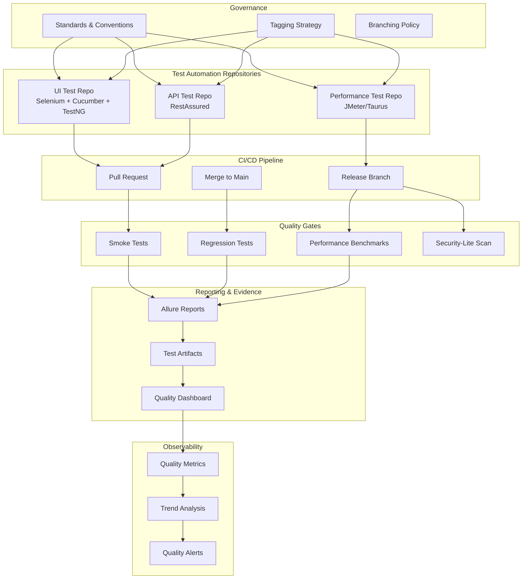
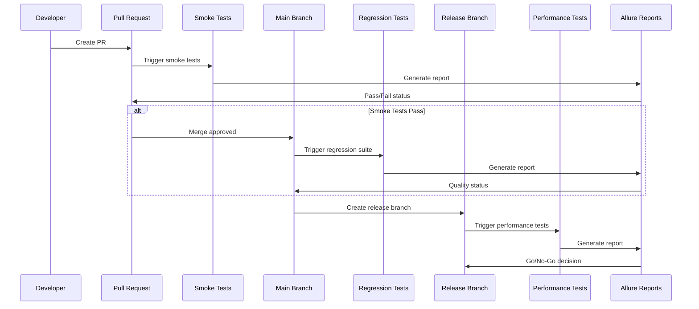

# Platform Overview

## Introduction

The Quality Engineering Platform is a comprehensive ecosystem designed to ensure release-grade quality across all software deliverables. This document provides a high-level overview of the platform architecture, components, and principles.

## Platform Principles

1. **Quality as Code**: Quality gates are defined as code and enforced automatically
2. **Shift-Left Testing**: Tests run as early as possible in the development lifecycle
3. **Evidence-Based Decisions**: All quality decisions are backed by test evidence
4. **Observability First**: Quality metrics are visible and actionable
5. **Governance Through Standards**: Consistency achieved through documented standards

## Platform Components

## Component Details

### 1. Test Automation Repositories

Three specialized repositories handle different testing concerns:

- **UI Test Repository**: End-to-end UI automation using Selenium WebDriver, Cucumber for BDD, and TestNG for test execution
- **API Test Repository**: API contract and integration testing using RestAssured
- **Performance Test Repository**: Load, stress, and performance testing using JMeter/Taurus

Each repository follows the standards defined in this reference architecture.

### 2. CI/CD Quality Gates

Quality gates are automated checkpoints that prevent low-quality code from progressing:

- **Smoke Tests**: Fast, critical path tests run on every PR
- **Regression Tests**: Comprehensive test suite run before merge to main
- **Performance Benchmarks**: Performance tests run as release gates
- **Security-Lite Scan**: Basic vulnerability scanning before release

See [Quality Gates](03-quality-gates.md) for detailed definitions.

### 3. Reporting & Evidence

All test executions generate evidence:

- **Allure Reports**: Rich HTML reports with screenshots, logs, and history
- **Test Artifacts**: Screenshots, videos, logs stored for traceability
- **Quality Dashboard**: Aggregated view of quality metrics across repositories

See [Reporting and Evidence](07-reporting-and-evidence.md) for standards.

### 4. Observability

Quality metrics are continuously monitored:

- **Quality Metrics**: Test pass rates, execution times, flaky test rates
- **Trend Analysis**: Historical quality trends and predictions
- **Quality Alerts**: Automated alerts for quality degradation

See [Observability](08-observability.md) for implementation details.

### 5. Governance

Standards ensure consistency across all repositories:

- **Standards & Conventions**: Test naming, structure, and organization
- **Tagging Strategy**: Test categorization and filtering
- **Branching Policy**: Git workflow and branch naming

See [Test Strategy Standards](05-test-strategy-standards.md) for details.

## Platform Workflow

## Integration Points

The platform integrates with:

- **Version Control**: Git repositories (GitHub, GitLab, etc.)
- **CI/CD Systems**: GitHub Actions, Jenkins, GitLab CI, etc.
- **Test Frameworks**: Selenium, RestAssured, JMeter, TestNG, Cucumber
- **Reporting Tools**: Allure TestOps or Allure Reports
- **Observability**: Prometheus, Grafana, or similar
- **Issue Tracking**: Jira, GitHub Issues, etc.

## Next Steps

- Review [Repository Ecosystem Map](02-repo-ecosystem-map.md) to understand repository relationships
- Read [Quality Gates](03-quality-gates.md) to implement quality checkpoints
- See [Onboarding Playbook](09-onboarding-playbook.md) for team adoption

