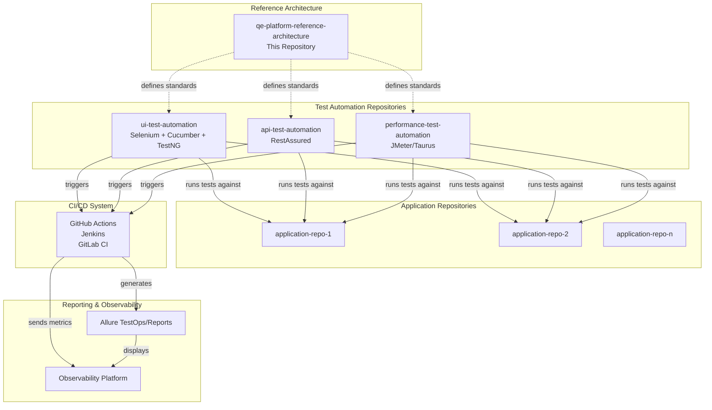
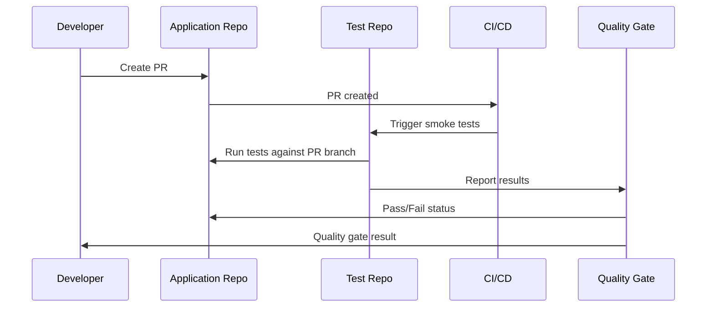
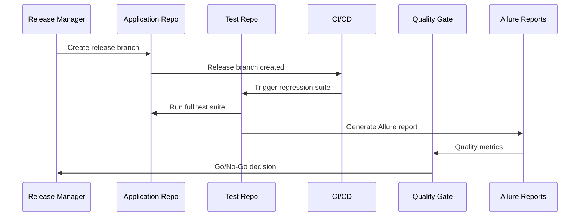
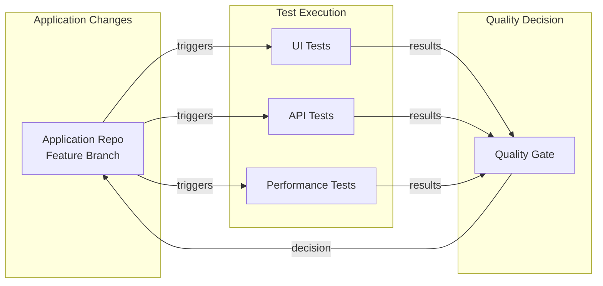
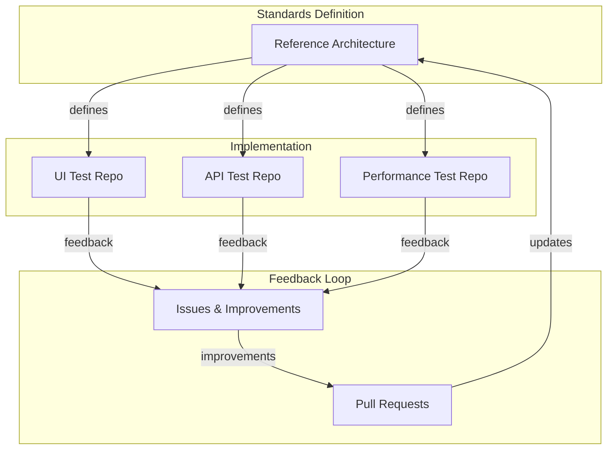

# Repository Ecosystem Map

## Overview

This document maps the relationships between the reference architecture repository and the actual test automation repositories that implement it.

## Repository Relationships



## Repository Responsibilities

### Reference Architecture Repository (This Repo)

**Purpose**: Define standards, workflows, and governance

**Contains**:

- Quality gate definitions
- Test strategy standards
- Governance policies
- Release workflows
- Onboarding guides

**Does NOT contain**:

- Actual test code
- Application-specific configurations
- Proprietary information

### UI Test Automation Repository

**Purpose**: End-to-end UI testing

**Implements**:

- Selenium WebDriver tests
- Cucumber BDD scenarios
- TestNG test execution
- Page Object Model pattern

**References**:

- This repository for standards
- Application repositories for test targets

**Generates**:

- Allure reports with screenshots
- Test execution artifacts

### API Test Automation Repository

**Purpose**: API contract and integration testing

**Implements**:

- RestAssured API tests
- Contract testing
- API performance tests
- Schema validation

**References**:

- This repository for standards
- API documentation (OpenAPI/Swagger)

**Generates**:

- Allure reports with request/response logs
- API test execution artifacts

### Performance Test Automation Repository

**Purpose**: Load, stress, and performance testing

**Implements**:

- JMeter test plans
- Taurus configurations
- Performance benchmarks
- Load scenarios

**References**:

- This repository for standards
- Performance requirements

**Generates**:

- Performance test reports
- Performance trend data

## Integration Patterns

### Pattern 1: PR Quality Gate



### Pattern 2: Release Quality Gate



### Pattern 3: Cross-Repository Testing



## Repository Naming Conventions

All repositories follow a consistent naming pattern:

- **Reference Architecture**: `qe-platform-reference-architecture`
- **UI Tests**: `{org}-ui-test-automation` or `ui-test-automation`
- **API Tests**: `{org}-api-test-automation` or `api-test-automation`
- **Performance Tests**: `{org}-performance-test-automation` or `performance-test-automation`

## Repository Structure Alignment

Each test automation repository should align with this reference architecture:

```text
test-automation-repo/
├── README.md                    # References this architecture
├── .github/
│   └── workflows/
│       └── quality-gates.yml    # Implements quality gates from this repo
├── src/
│   └── test/                    # Test code following standards
├── docs/
│   └── README.md                # Repository-specific docs
└── pom.xml / package.json       # Dependencies
```

## Dependency Management

### Test Repositories Depend On

- **Reference Architecture**: For standards and governance (documentation dependency)
- **Application Repositories**: For test targets (runtime dependency)
- **Test Frameworks**: Selenium, RestAssured, JMeter (library dependency)

### Reference Architecture Depends On

- **Nothing**: This is a standalone reference

## Versioning Strategy

- **Reference Architecture**: Semantic versioning (e.g., v1.0.0)
- **Test Repositories**: Follow application versioning or semantic versioning
- **Standards Compatibility**: Test repositories should reference specific versions of this architecture

## Communication Flow



## Next Steps

- Review [Quality Gates](03-quality-gates.md) to understand integration points
- See [Test Strategy Standards](05-test-strategy-standards.md) for implementation details
- Check [Onboarding Playbook](09-onboarding-playbook.md) for repository setup
