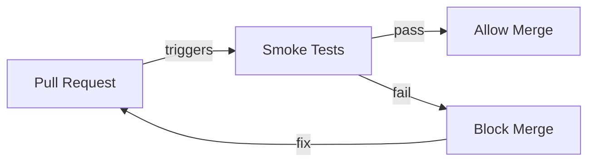
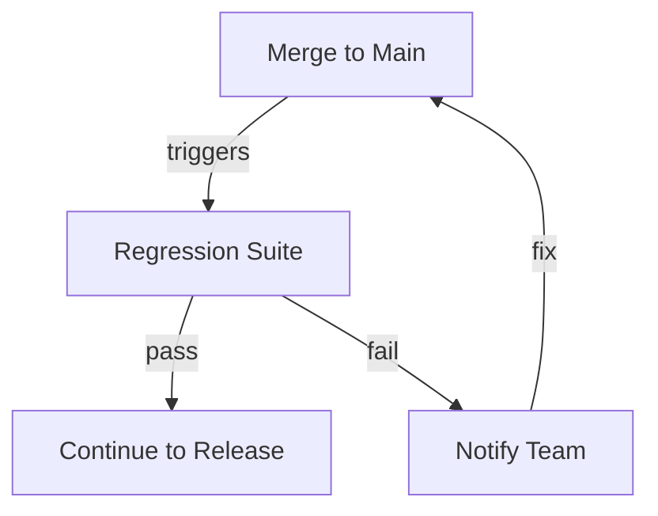
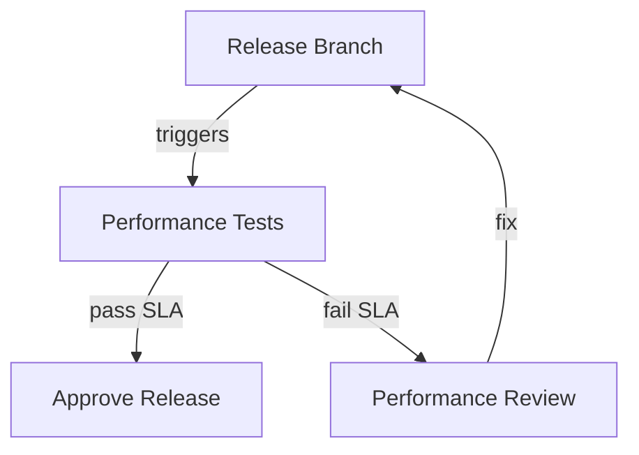
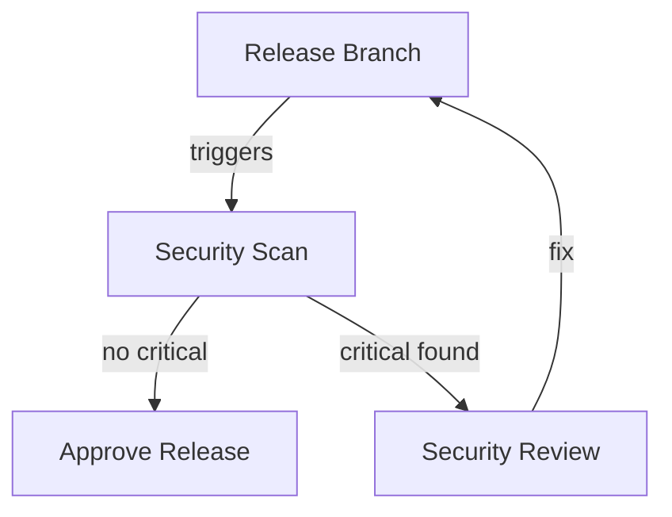
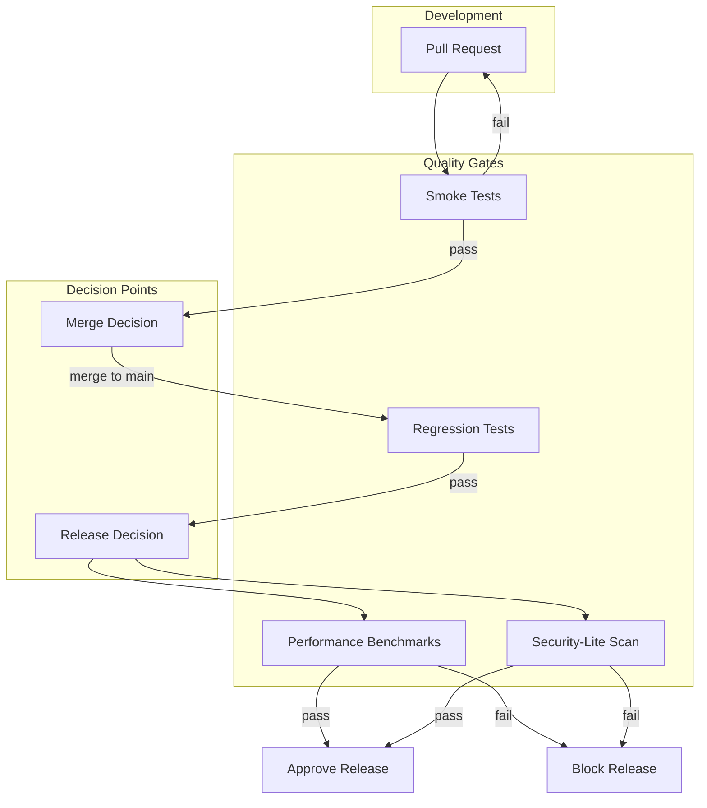

# Quality Gates

## Overview

Quality gates are automated checkpoints in the CI/CD pipeline that prevent low-quality code from progressing to the next stage. This document defines the quality gates used in the QE platform.

## Quality Gate Types

### 1. Smoke Tests (Pre-Merge)

**Purpose**: Fast validation of critical functionality before code merge

**When**: Runs on every Pull Request

**Scope**:

- Critical user journeys (3-5 scenarios)
- Authentication flows
- Core business logic
- API health checks

**Success Criteria**:

- All smoke tests must pass
- Execution time < 10 minutes
- No blocking defects

**Failure Action**: Block PR merge



### 2. Regression Tests (Pre-Release)

**Purpose**: Comprehensive validation before release

**When**: Runs on merge to main branch and before release

**Scope**:

- Full test suite (UI, API, integration)
- Cross-browser testing (for UI)
- Data validation tests
- Error handling tests

**Success Criteria**:

- All regression tests must pass
- Test coverage > 80%
- No critical or high-severity defects
- Flaky test rate < 5%

**Failure Action**: Block release, notify team



### 3. Performance Benchmarks (Release Gate)

**Purpose**: Ensure performance requirements are met

**When**: Runs on release branch creation

**Scope**:

- Response time benchmarks
- Throughput requirements
- Resource utilization
- Load test scenarios

**Success Criteria**:

- Response times within SLA
- Throughput meets requirements
- No performance regressions
- Resource usage acceptable

**Failure Action**: Block release, performance review required



### 4. Security-Lite Scan (Release Gate)

**Purpose**: Basic vulnerability detection

**When**: Runs on release branch creation

**Scope**:

- Dependency vulnerability scan
- OWASP Top 10 checks
- API security basics
- Secrets detection

**Success Criteria**:

- No critical vulnerabilities
- No high-severity vulnerabilities (configurable)
- Dependencies up to date

**Failure Action**: Block release, security review required



## Quality Gate Workflow



## Quality Gate Configuration

### Smoke Test Configuration

```yaml
quality_gate:
  smoke_tests:
    trigger: pull_request
    timeout: 10 minutes
    required_status: all_pass
    test_tags: ["@smoke", "@critical"]
    parallel_execution: true
    max_retries: 0
```

### Regression Test Configuration

```yaml
quality_gate:
  regression_tests:
    trigger: merge_to_main
    timeout: 60 minutes
    required_status: all_pass
    test_tags: ["@regression"]
    parallel_execution: true
    max_retries: 1
    flaky_threshold: 5%
```

### Performance Test Configuration

```yaml
quality_gate:
  performance_tests:
    trigger: release_branch
    timeout: 30 minutes
    required_status: sla_met
    benchmarks:
      response_time_p95: 500ms
      throughput: 1000 req/s
      error_rate: 0.1%
```

### Security Scan Configuration

```yaml
quality_gate:
  security_scan:
    trigger: release_branch
    timeout: 15 minutes
    required_status: no_critical
    severity_levels:
      critical: block
      high: block
      medium: warn
      low: info
```

## Quality Gate Metrics

Track the following metrics for each quality gate:

- **Pass Rate**: Percentage of gate executions that pass
- **Average Execution Time**: Time to complete gate
- **Failure Rate by Category**: Breakdown of failure reasons
- **Time to Fix**: Average time to resolve gate failures
- **Gate Effectiveness**: Defects caught vs. escaped

## Quality Gate Exceptions

Quality gates should be enforced strictly, but exceptions may be granted for:

1. **Emergency Hotfixes**: With approval from QE lead and release manager
2. **Known Issues**: Documented and tracked, with timeline for resolution
3. **Infrastructure Issues**: Temporary gate bypass with post-deployment validation

All exceptions must be:

- Documented in the release notes
- Approved by QE lead
- Tracked in issue management system
- Followed up with post-deployment validation

## Implementation Guidelines

### For Test Repositories

1. **Tag Tests Appropriately**:
   - `@smoke` for smoke tests
   - `@regression` for regression tests
   - `@performance` for performance tests

2. **Configure CI/CD**:
   - Set up quality gate triggers
   - Configure timeouts
   - Set up notifications

3. **Generate Reports**:
   - Allure reports for all gate executions
   - Artifact retention per policy

### For CI/CD Pipelines

1. **Gate Execution**:
   - Run gates in parallel where possible
   - Fail fast on critical failures
   - Provide clear failure messages

2. **Reporting**:
   - Link to Allure reports
   - Include gate status in PR comments
   - Update quality dashboards

## Next Steps

- Review [Release Workflows](04-release-workflows.md) for gate integration
- See [Test Strategy Standards](05-test-strategy-standards.md) for test tagging
- Check [Reporting and Evidence](07-reporting-and-evidence.md) for report requirements
