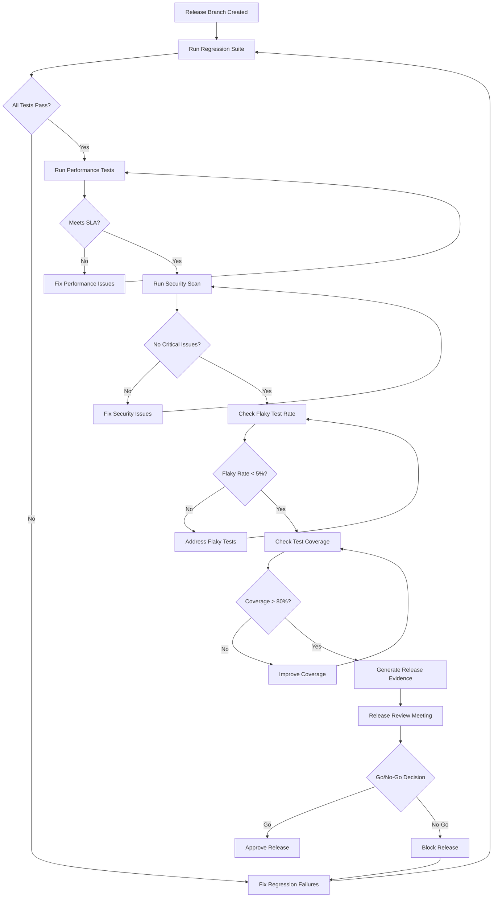
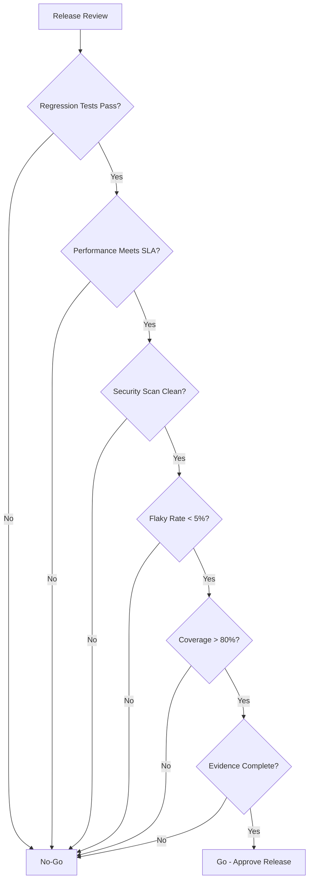
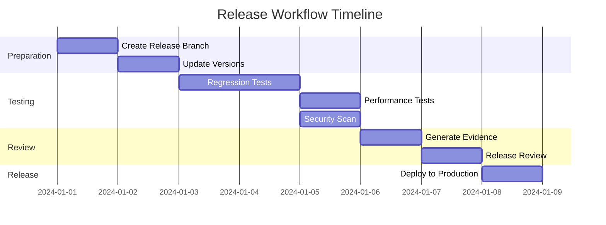
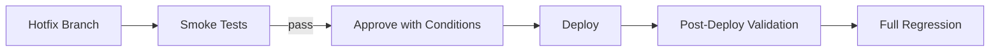

# Release Workflows

## Overview

This document defines the release workflows and decision flows for determining release readiness. All releases must go through these workflows to ensure quality.

## Release Readiness Decision Flow

## Release Workflow Stages

### Stage 1: Pre-Release Preparation

**Activities**:

- Create release branch from main
- Update version numbers
- Prepare release notes
- Notify stakeholders

**Quality Checks**:

- Code review completed
- Documentation updated
- Dependencies updated

### Stage 2: Regression Testing

**Activities**:

- Run full regression test suite
- Execute cross-browser tests (UI)
- Validate API contracts
- Check integration points

**Success Criteria**:

- All regression tests pass
- No critical or high-severity defects
- Test execution completed successfully

**Failure Action**: Fix defects and re-run regression suite

### Stage 3: Performance Validation

**Activities**:

- Execute performance test suite
- Validate response time SLAs
- Check throughput requirements
- Monitor resource utilization

**Success Criteria**:

- All performance benchmarks met
- No performance regressions
- Resource usage within limits

**Failure Action**: Performance optimization and re-test

### Stage 4: Security Scanning

**Activities**:

- Run dependency vulnerability scan
- Execute security-lite checks
- Validate API security
- Check for exposed secrets

**Success Criteria**:

- No critical vulnerabilities
- No high-severity vulnerabilities (configurable)
- Security best practices followed

**Failure Action**: Security fixes and re-scan

### Stage 5: Quality Metrics Review

**Activities**:

- Check flaky test rate
- Validate test coverage
- Review quality trends
- Analyze test execution metrics

**Success Criteria**:

- Flaky test rate < 5%
- Test coverage > 80%
- Quality trends stable or improving

**Failure Action**: Address quality issues and re-validate

### Stage 6: Release Evidence Generation

**Activities**:

- Generate Allure reports
- Archive test artifacts
- Create release readiness dashboard
- Document test results

**Deliverables**:

- Allure test report
- Performance test report
- Security scan report
- Release readiness summary

### Stage 7: Release Review

**Activities**:

- Review all quality evidence
- Discuss any exceptions
- Make go/no-go decision
- Document decision rationale

**Participants**:

- Release Manager
- QE Lead
- Engineering Lead
- Product Owner (if applicable)

## Go/No-Go Decision Matrix

## Release Workflow Timeline

## Emergency Release Workflow

For emergency hotfixes, a streamlined workflow applies:

**Conditions for Emergency Release**:

- Critical production issue
- Approval from QE lead and release manager
- Smoke tests must pass
- Post-deployment validation required
- Full regression within 24 hours

## Release Artifacts

Every release must include:

1. **Test Reports**:
   - Allure test execution report
   - Performance test report
   - Security scan report

2. **Release Notes**:
   - Features and fixes
   - Known issues
   - Quality gate status
   - Test coverage summary

3. **Evidence Package**:
   - Test execution logs
   - Screenshots/videos (for UI tests)
   - API test request/response logs
   - Performance metrics

## Release Communication

### Pre-Release

- Notify stakeholders of release branch creation
- Share release timeline
- Communicate quality gate status

### Post-Release

- Share release notes
- Communicate quality metrics
- Report any post-deployment issues

## Release Metrics

Track the following metrics per release:

- **Time to Release**: From branch creation to production
- **Quality Gate Pass Rate**: Percentage of gates passed
- **Defect Escape Rate**: Defects found post-release
- **Rollback Rate**: Percentage of releases rolled back
- **Release Frequency**: Number of releases per time period

## Continuous Improvement

After each release:

1. **Retrospective**: Review release process
2. **Metrics Analysis**: Analyze quality metrics
3. **Process Updates**: Update workflows based on learnings
4. **Documentation**: Update release documentation

## Next Steps

- Review [Quality Gates](03-quality-gates.md) for gate definitions
- See [Reporting and Evidence](07-reporting-and-evidence.md) for artifact requirements
- Check [Test Strategy Standards](05-test-strategy-standards.md) for test execution standards
