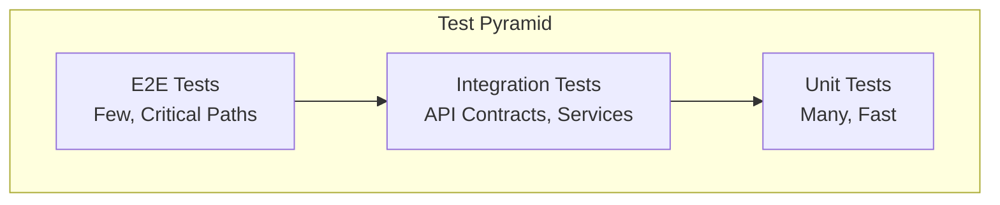
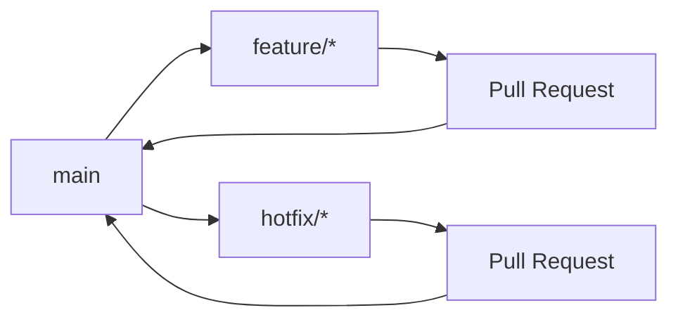

# Test Strategy Standards

## Overview

This document defines the test strategy, naming conventions, tagging strategy, branching policies, and PR requirements for all test automation repositories.

## Test Strategy

### Test Pyramid



**Distribution**:
- **Unit Tests**: 70% - Fast, isolated, developer-written
- **Integration Tests**: 20% - API contracts, service integration
- **E2E Tests**: 10% - Critical user journeys, release validation

### Test Types

1. **Smoke Tests** (`@smoke`):
   - Critical path validation
   - Authentication flows
   - Core business logic
   - Execution time: < 10 minutes

2. **Regression Tests** (`@regression`):
   - Full test coverage
   - All features
   - Cross-browser (UI)
   - Execution time: < 60 minutes

3. **Performance Tests** (`@performance`):
   - Load testing
   - Stress testing
   - Response time validation
   - Execution time: < 30 minutes

4. **Security Tests** (`@security`):
   - Vulnerability scanning
   - API security
   - Authentication/authorization
   - Execution time: < 15 minutes

## Naming Conventions

### Test Class Naming

**Format**: `{Feature}Test` or `{Feature}{Type}Test`

**Examples**:
- `LoginTest.java`
- `UserRegistrationTest.java`
- `PaymentAPITest.java`
- `CheckoutE2ETest.java`

### Test Method Naming

**Format**: `test{Scenario}` or `should{ExpectedBehavior}When{Condition}`

**Examples**:
- `testUserCanLoginWithValidCredentials()`
- `shouldReturnErrorWhenInvalidCredentialsProvided()`
- `testPaymentProcessingWithValidCard()`

### Feature File Naming (Cucumber)

**Format**: `{feature-name}.feature`

**Examples**:
- `user-login.feature`
- `shopping-cart.feature`
- `payment-processing.feature`

### Scenario Naming (Cucumber)

**Format**: Descriptive scenario titles

**Examples**:
- `User can login with valid credentials`
- `User cannot login with invalid password`
- `User is locked out after 3 failed attempts`

## Tagging Strategy

### Tag Categories

1. **Test Type Tags**:
   - `@smoke` - Smoke tests
   - `@regression` - Regression tests
   - `@performance` - Performance tests
   - `@security` - Security tests

2. **Feature Tags**:
   - `@login` - Login functionality
   - `@checkout` - Checkout process
   - `@payment` - Payment processing
   - `@user-management` - User management

3. **Environment Tags**:
   - `@dev` - Development environment
   - `@staging` - Staging environment
   - `@prod` - Production environment (read-only)

4. **Browser Tags** (UI Tests):
   - `@chrome` - Chrome browser
   - `@firefox` - Firefox browser
   - `@safari` - Safari browser
   - `@edge` - Edge browser

5. **Priority Tags**:
   - `@critical` - Critical tests
   - `@high` - High priority tests
   - `@medium` - Medium priority tests
   - `@low` - Low priority tests

### Tag Usage Examples

```java
@Test
@Tag("smoke")
@Tag("critical")
@Tag("login")
public void testUserCanLoginWithValidCredentials() {
    // Test implementation
}
```

```gherkin
@smoke @critical @login
Feature: User Login
  Scenario: User can login with valid credentials
    Given the user is on the login page
    When the user enters valid credentials
    Then the user should be logged in successfully
```

## Branching Policy

### Branch Naming

**Format**: `{type}/{description}`

**Types**:
- `feature/` - New features or test scenarios
- `bugfix/` - Bug fixes
- `hotfix/` - Emergency fixes
- `refactor/` - Code refactoring
- `docs/` - Documentation updates

**Examples**:
- `feature/add-payment-tests`
- `bugfix/fix-flaky-login-test`
- `hotfix/fix-test-timeout`
- `refactor/improve-page-objects`
- `docs/update-test-standards`

### Branch Workflow



**Rules**:
- All changes must go through Pull Requests
- `main` branch is always deployable
- Feature branches are deleted after merge
- Hotfix branches are merged to `main` and any active release branches

## Pull Request Policy

### PR Requirements

1. **Description**:
   - Clear description of changes
   - Link to related issues
   - Test execution results
   - Screenshots (for UI changes)

2. **Quality Checks**:
   - All CI/CD checks pass
   - Code follows naming conventions
   - Tests are properly tagged
   - Documentation updated (if needed)

3. **Review Requirements**:
   - At least one approval from CODEOWNERS
   - No blocking comments
   - All discussions resolved

### PR Template

```markdown
## Description
Brief description of changes

## Related Issues
Closes #123

## Test Results
- Smoke tests: ✅ Pass
- Regression tests: ✅ Pass
- Link to Allure report: [link]

## Checklist
- [ ] Tests added/updated
- [ ] Documentation updated
- [ ] Code follows naming conventions
- [ ] Tests properly tagged
- [ ] CI/CD checks pass
```

## Test Organization

### Directory Structure

```
src/
└── test/
    ├── java/
    │   └── com/
    │       └── yourorg/
    │           └── tests/
    │               ├── ui/
    │               │   ├── login/
    │               │   ├── checkout/
    │               │   └── payment/
    │               ├── api/
    │               │   ├── users/
    │               │   ├── products/
    │               │   └── orders/
    │               └── performance/
    │                   ├── load/
    │                   └── stress/
    └── resources/
        ├── features/          # Cucumber feature files
        ├── test-data/         # Test data files
        └── config/            # Configuration files
```

### Page Object Model (UI Tests)

**Structure**:
```
pages/
├── BasePage.java
├── LoginPage.java
├── CheckoutPage.java
└── PaymentPage.java
```

**Pattern**:
- One page object per page/screen
- Methods return page objects for chaining
- Locators defined as constants
- Wait strategies implemented

## Test Data Management

### Test Data Strategy

1. **Static Test Data**: JSON/YAML files for reusable data
2. **Dynamic Test Data**: Generated at runtime
3. **Test Data Isolation**: Each test uses isolated data
4. **Cleanup**: Test data cleaned up after execution

### Test Data Naming

**Format**: `{feature}-{purpose}.json`

**Examples**:
- `user-valid-credentials.json`
- `payment-valid-card.json`
- `checkout-complete-flow.json`

## Code Standards

### Java Standards

- Follow Java naming conventions
- Use meaningful variable names
- Keep methods focused (single responsibility)
- Maximum method length: 50 lines
- Add comments for complex logic

### Test Standards

- One assertion per test (when possible)
- Use descriptive test names
- Arrange-Act-Assert pattern
- Independent tests (no dependencies)
- Clean up after tests

## Reporting Standards

All tests must generate:

1. **Allure Reports**:
   - Test execution results
   - Screenshots (UI tests)
   - Request/response logs (API tests)
   - Performance metrics (performance tests)

2. **Test Artifacts**:
   - Screenshots on failure
   - Videos for flaky tests
   - Logs for debugging

## Next Steps

- Review [Flaky Tests Policy](06-flaky-tests-policy.md) for test reliability
- See [Reporting and Evidence](07-reporting-and-evidence.md) for report standards
- Check [Quality Gates](03-quality-gates.md) for gate requirements

