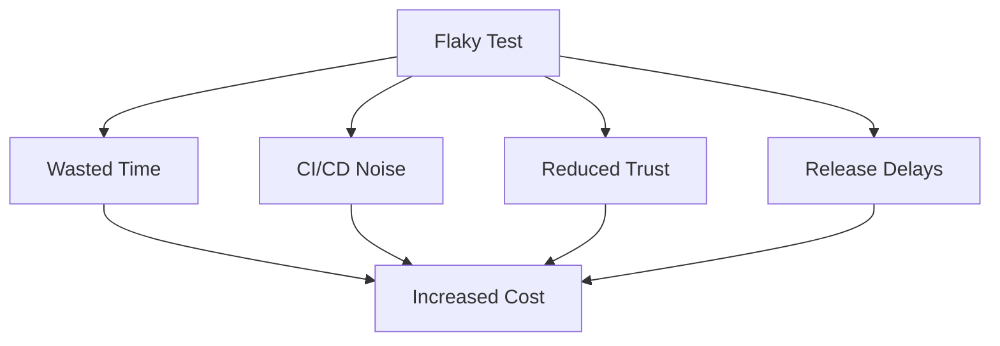
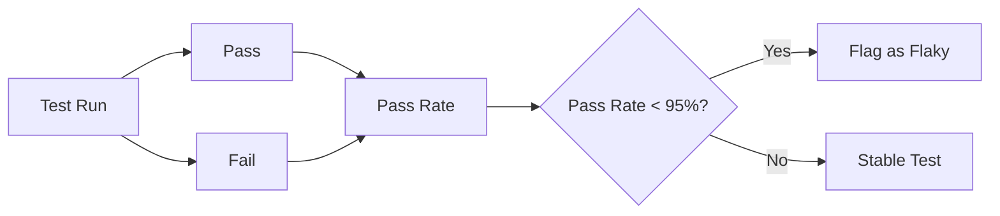
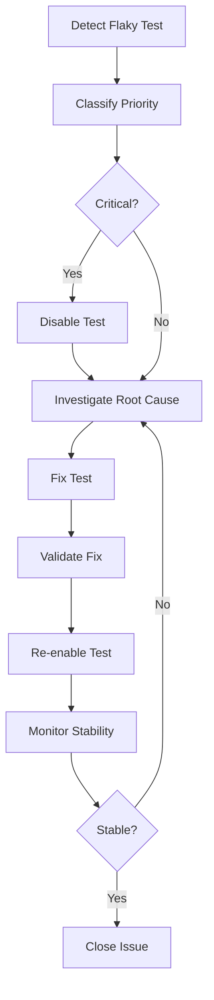

# Flaky Tests Policy

## Overview

Flaky tests are tests that produce inconsistent results—passing and failing for the same code without any changes. This document defines the policy for detecting, managing, and resolving flaky tests.

## Flaky Test Definition

A test is considered flaky if it:

- Passes and fails intermittently for the same code
- Has inconsistent results across multiple runs
- Fails due to timing, race conditions, or external dependencies
- Cannot be reliably reproduced

## Flaky Test Impact



## Flaky Test Categories

### 1. Timing Issues

**Causes**:

- Insufficient wait times
- Race conditions
- Async operations not awaited

**Examples**:

- Element not found (page still loading)
- API response not received
- Database transaction not committed

### 2. Test Isolation Issues

**Causes**:

- Shared test data
- State leakage between tests
- Incomplete cleanup

**Examples**:

- Test fails when run after another test
- Data conflicts between tests
- Environment state not reset

### 3. External Dependencies

**Causes**:

- Third-party services unavailable
- Network issues
- Environment inconsistencies

**Examples**:

- External API timeouts
- Database connection failures
- File system permissions

### 4. Environment Issues

**Causes**:

- Browser/OS differences
- Resource constraints
- Configuration drift

**Examples**:

- Browser-specific behavior
- Memory limitations
- Missing environment variables

## Flaky Test Detection

### Detection Methods

1. **Automated Detection**:
   - Run tests multiple times
   - Track pass/fail rates
   - Identify inconsistent results

2. **CI/CD Integration**:
   - Monitor test execution history
   - Flag tests with < 95% pass rate
   - Alert on flaky test detection

3. **Manual Reporting**:
   - Team members report flaky tests
   - Track in issue management system
   - Prioritize based on impact

### Detection Metrics



**Thresholds**:

- **Stable**: Pass rate ≥ 95%
- **Flaky**: Pass rate < 95%
- **Critical Flaky**: Pass rate < 80%

## Flaky Test Management

### Classification

1. **Critical Flaky** (Pass rate < 80%):
   - Blocks releases
   - Immediate action required
   - May be disabled temporarily

2. **High Priority Flaky** (Pass rate 80-90%):
   - Affects CI/CD reliability
   - Fix within 1 sprint
   - Monitor closely

3. **Medium Priority Flaky** (Pass rate 90-95%):
   - Minor impact
   - Fix within 2 sprints
   - Track in backlog

### Flaky Test Workflow



## Flaky Test Resolution

### Resolution Steps

1. **Reproduce**:
   - Run test multiple times
   - Identify failure pattern
   - Document failure conditions

2. **Investigate**:
   - Review test code
   - Check logs and screenshots
   - Analyze timing and dependencies

3. **Fix**:
   - Address root cause
   - Add proper waits/synchronization
   - Improve test isolation
   - Mock external dependencies

4. **Validate**:
   - Run test multiple times
   - Verify pass rate > 95%
   - Monitor for 1 week

### Common Fixes

**Timing Issues**:

- Use explicit waits instead of fixed delays
- Wait for specific conditions
- Handle async operations properly

**Isolation Issues**:

- Ensure test data isolation
- Clean up after each test
- Reset environment state

**External Dependencies**:

- Mock external services
- Use test doubles
- Implement retry logic (with caution)

**Environment Issues**:

- Standardize test environments
- Use containerization
- Validate environment setup

## Flaky Test Prevention

### Best Practices

1. **Test Design**:
   - Write deterministic tests
   - Avoid hard-coded delays
   - Use proper synchronization

2. **Test Isolation**:
   - Each test is independent
   - No shared state
   - Proper cleanup

3. **Wait Strategies**:
   - Explicit waits for conditions
   - Avoid Thread.sleep()
   - Handle async operations

4. **Test Data**:
   - Unique test data per test
   - Clean up test data
   - Avoid data conflicts

5. **Environment**:
   - Consistent test environments
   - Isolated test execution
   - Proper resource allocation

## Flaky Test Metrics

Track the following metrics:

- **Flaky Test Rate**: Percentage of tests that are flaky
- **Flaky Test Count**: Number of flaky tests
- **Time to Fix**: Average time to resolve flaky tests
- **Recurrence Rate**: Percentage of flaky tests that become flaky again

### Target Metrics

- **Flaky Test Rate**: < 5%
- **Critical Flaky Tests**: 0
- **Time to Fix**: < 3 days for critical, < 1 sprint for others

## Flaky Test Reporting

### Report Format

```markdown
## Flaky Test Report

**Test**: `com.example.LoginTest.testUserLogin()`
**Pass Rate**: 75% (15/20 runs)
**Priority**: Critical
**First Detected**: 2024-01-15
**Status**: Investigating

### Failure Pattern
- Fails 25% of the time
- Failure: Element not found
- Timing: Usually fails on first run after deployment

### Root Cause
- Insufficient wait for login page load
- Race condition with authentication

### Fix
- Added explicit wait for login button
- Improved synchronization

### Validation
- Pass rate after fix: 100% (20/20 runs)
- Monitoring for 1 week
```

## Flaky Test Dashboard

Maintain a dashboard showing:

- List of flaky tests
- Pass rates over time
- Resolution status
- Trends and patterns

## Escalation Process

1. **Team Level**: Team addresses flaky tests in sprint
2. **Platform Level**: Platform team assists with complex issues
3. **Leadership**: Escalate if flaky rate > 10% or blocking releases

## Next Steps

- Review [Test Strategy Standards](05-test-strategy-standards.md) for test design best practices
- See [Quality Gates](03-quality-gates.md) for flaky test thresholds
- Check [Observability](08-observability.md) for monitoring flaky tests
