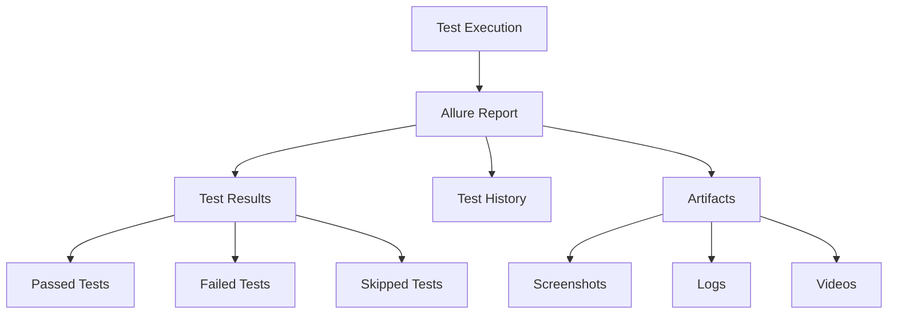
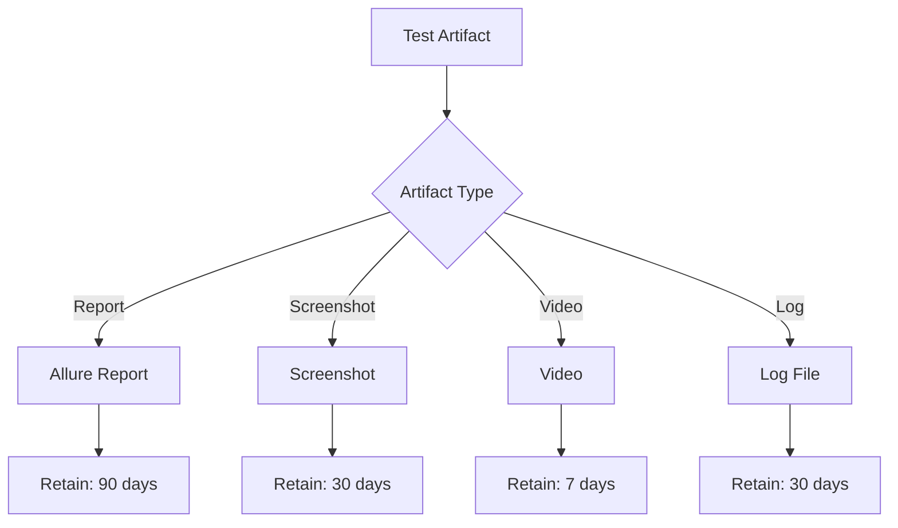
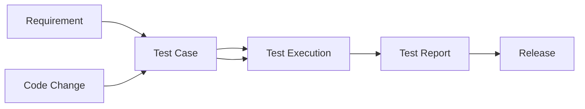

# Reporting and Evidence

## Overview

This document defines the reporting standards and evidence requirements for all test executions. All tests must generate comprehensive reports and artifacts for traceability and decision-making.

## Reporting Requirements

### Allure Reports

Allure is the standard reporting tool for all test repositories.

**Required Components**:
- Test execution results
- Test history and trends
- Screenshots (UI tests)
- Request/response logs (API tests)
- Performance metrics (performance tests)
- Attachments (logs, videos, etc.)

### Report Structure



## Allure Report Configuration

### Basic Configuration

```xml
<!-- Maven pom.xml -->
<plugin>
    <groupId>io.qameta.allure</groupId>
    <artifactId>allure-maven</artifactId>
    <version>2.12.0</version>
</plugin>
```

### Report Generation

```bash
# Generate Allure report
mvn allure:report

# Serve Allure report locally
mvn allure:serve
```

### CI/CD Integration

```yaml
# GitHub Actions example
- name: Generate Allure Report
  run: mvn allure:report

- name: Publish Allure Report
  uses: simple-elf/allure-report-action@master
  with:
    allure_results: target/allure-results
```

## Report Content Requirements

### Test Execution Summary

Every report must include:

1. **Summary Statistics**:
   - Total tests executed
   - Passed/Failed/Skipped counts
   - Execution time
   - Pass rate percentage

2. **Test Results**:
   - Test name and status
   - Execution time
   - Error messages (for failures)
   - Stack traces (for failures)

3. **Test History**:
   - Historical pass/fail rates
   - Trend analysis
   - Flaky test identification

### UI Test Reports

**Required Attachments**:
- Screenshots on failure
- Screenshots on key steps (configurable)
- Browser console logs
- Network logs (optional)

**Example Structure**:
```
Allure Report
├── Test Results
│   ├── Login Tests
│   │   ├── testUserLogin (PASSED)
│   │   │   ├── Screenshot: login-success.png
│   │   │   └── Log: browser-console.log
│   │   └── testInvalidLogin (FAILED)
│   │       ├── Screenshot: login-failure.png
│   │       ├── Error: Element not found
│   │       └── Stack Trace
```

### API Test Reports

**Required Attachments**:
- Request details (method, URL, headers, body)
- Response details (status, headers, body)
- Response time
- Assertion results

**Example Structure**:
```
Allure Report
├── Test Results
│   ├── API Tests
│   │   ├── testGetUser (PASSED)
│   │   │   ├── Request: GET /api/users/123
│   │   │   ├── Response: 200 OK
│   │   │   ├── Response Time: 150ms
│   │   │   └── Assertions: All passed
│   │   └── testCreateUser (FAILED)
│   │       ├── Request: POST /api/users
│   │       ├── Response: 400 Bad Request
│   │       ├── Error: Validation failed
│   │       └── Response Body
```

### Performance Test Reports

**Required Metrics**:
- Response time (p50, p95, p99)
- Throughput (requests per second)
- Error rate
- Resource utilization

**Example Structure**:
```
Allure Report
├── Performance Results
│   ├── Load Test: 100 users
│   │   ├── Response Time: p95 = 500ms
│   │   ├── Throughput: 1000 req/s
│   │   ├── Error Rate: 0.1%
│   │   └── CPU Usage: 60%
```

## Artifact Retention

### Retention Policy



**Retention Periods**:
- **Allure Reports**: 90 days
- **Screenshots**: 30 days
- **Videos**: 7 days (only for failures)
- **Log Files**: 30 days
- **Performance Reports**: 1 year (for trend analysis)

### Artifact Storage

- **CI/CD Artifacts**: Stored in CI/CD system (GitHub Actions, Jenkins, etc.)
- **Allure Reports**: Published to Allure TestOps or static hosting
- **Long-term Storage**: Archived to object storage (S3, Azure Blob, etc.)

## Traceability

### Requirements Traceability

All tests must be traceable to:

1. **Requirements**:
   - Link tests to user stories/requirements
   - Use tags or metadata for traceability
   - Document coverage in reports

2. **Code Changes**:
   - Link test results to commits
   - Track which tests validate which changes
   - Show test coverage per change

3. **Releases**:
   - Link test results to releases
   - Show test execution for each release
   - Document release readiness

### Traceability Matrix



## Release Evidence Package

Every release must include an evidence package:

### Evidence Package Contents

1. **Test Execution Summary**:
   - Total tests executed
   - Pass/fail counts
   - Execution time
   - Coverage metrics

2. **Quality Gate Status**:
   - Smoke tests: Pass/Fail
   - Regression tests: Pass/Fail
   - Performance tests: Pass/Fail
   - Security scan: Pass/Fail

3. **Test Reports**:
   - Allure report link
   - Performance report link
   - Security scan report link

4. **Artifacts**:
   - Key screenshots
   - Critical logs
   - Performance metrics

5. **Release Readiness Statement**:
   - Go/No-Go decision
   - Rationale
   - Known issues
   - Risk assessment

### Evidence Package Format

```markdown
# Release Evidence Package

**Release**: v1.2.3
**Date**: 2024-01-15
**Status**: Approved for Release

## Test Execution Summary
- Total Tests: 1,234
- Passed: 1,200 (97.2%)
- Failed: 20 (1.6%)
- Skipped: 14 (1.1%)
- Execution Time: 45 minutes

## Quality Gate Status
- ✅ Smoke Tests: Passed
- ✅ Regression Tests: Passed
- ✅ Performance Tests: Passed
- ✅ Security Scan: Passed

## Test Reports
- [Allure Report](link-to-allure-report)
- [Performance Report](link-to-performance-report)
- [Security Report](link-to-security-report)

## Known Issues
- 2 medium-priority defects (tracked in JIRA)
- 1 flaky test (being monitored)

## Release Readiness
**Decision**: Go
**Rationale**: All quality gates passed, known issues are acceptable
```

## Report Accessibility

### Access Requirements

1. **Team Access**: All team members can access reports
2. **Stakeholder Access**: Reports shared with stakeholders
3. **Historical Access**: Historical reports archived and accessible

### Report Sharing

- **Internal**: Share via Allure TestOps or internal dashboard
- **External**: Generate static reports for external stakeholders
- **Archived**: Long-term storage for compliance/audit

## Report Quality Standards

### Quality Checklist

- [ ] All required metrics included
- [ ] Screenshots/logs attached for failures
- [ ] Test history available
- [ ] Traceability links present
- [ ] Report is readable and clear
- [ ] Artifacts are accessible

## Continuous Improvement

### Report Enhancement

- Gather feedback on report usefulness
- Add metrics based on team needs
- Improve visualization
- Enhance traceability

## Next Steps

- Review [Release Workflows](04-release-workflows.md) for evidence requirements
- See [Observability](08-observability.md) for quality metrics
- Check [Quality Gates](03-quality-gates.md) for gate reporting

