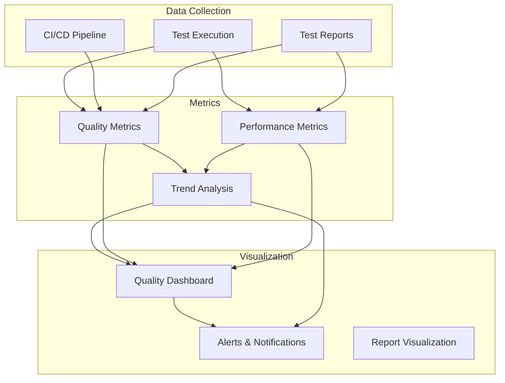
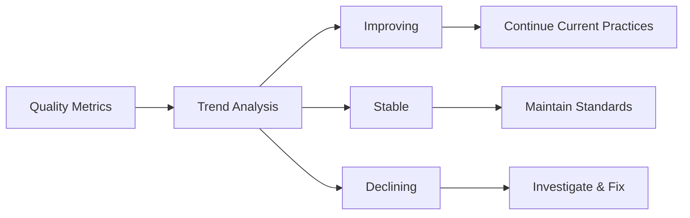
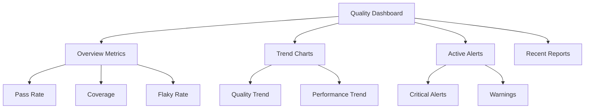

# Observability

## Overview

This document defines the observability strategy for the Quality Engineering platform. Observability enables teams to monitor quality metrics, detect issues early, and make data-driven decisions.

## Observability Components



## Quality Metrics

### Test Execution Metrics

1. **Test Pass Rate**:
   - Percentage of tests passing
   - Target: > 95%
   - Tracked per test suite and overall

2. **Test Execution Time**:
   - Average execution time
   - Trend over time
   - Identify slow tests

3. **Test Coverage**:
   - Code coverage percentage
   - Feature coverage
   - Requirement coverage

4. **Flaky Test Rate**:
   - Percentage of flaky tests
   - Target: < 5%
   - Tracked over time

### Quality Trends



### Key Performance Indicators (KPIs)

1. **Release Quality**:
   - Defect escape rate
   - Rollback rate
   - Post-release issues

2. **Test Efficiency**:
   - Tests per developer
   - Test execution frequency
   - Time to feedback

3. **Platform Health**:
   - CI/CD pipeline success rate
   - Test infrastructure uptime
   - Resource utilization

## Performance Metrics

### Test Performance

1. **Execution Speed**:
   - Average test execution time
   - Slowest tests
   - Parallel execution efficiency

2. **Resource Usage**:
   - CPU utilization
   - Memory usage
   - Network bandwidth

3. **Infrastructure Performance**:
   - Test environment availability
   - Database performance
   - API response times

### Performance Trends

Track performance metrics over time to identify:

- Performance degradation
- Resource constraints
- Optimization opportunities

## Quality Dashboard

### Dashboard Components



### Dashboard Metrics

**Real-time Metrics**:

- Current test execution status
- Active quality gate status
- Recent test results

**Historical Metrics**:

- Quality trends (last 30 days, 90 days, 1 year)
- Performance trends
- Release quality history

**Comparative Metrics**:

- Current vs. previous period
- Team comparisons
- Environment comparisons

## Alerts and Notifications

### Alert Types

1. **Critical Alerts**:
   - Quality gate failures
   - Critical test failures
   - Infrastructure outages

2. **Warning Alerts**:
   - Flaky test rate > 5%
   - Performance degradation
   - Coverage drop

3. **Info Alerts**:
   - Test execution completed
   - Reports generated
   - Metrics updates

### Alert Configuration

```yaml
alerts:
  quality_gate_failure:
    severity: critical
    channels: [slack, email]
    threshold: any_failure
    
  flaky_test_rate:
    severity: warning
    channels: [slack]
    threshold: > 5%
    
  performance_degradation:
    severity: warning
    channels: [slack]
    threshold: > 20% slower
```

### Notification Channels

- **Slack**: Real-time notifications for team
- **Email**: Summary reports and critical alerts
- **Dashboard**: Visual alerts and status indicators
- **PagerDuty**: Critical alerts for on-call rotation

## Trend Analysis

### Quality Trends

Track the following trends:

1. **Test Pass Rate Trend**:
   - Weekly/Monthly pass rate
   - Identify degradation patterns
   - Correlate with releases

2. **Flaky Test Trend**:
   - Flaky test count over time
   - Resolution rate
   - Recurrence patterns

3. **Coverage Trend**:
   - Test coverage over time
   - Coverage by feature
   - Coverage gaps

### Performance Trends

1. **Execution Time Trend**:
   - Average execution time
   - Slowest tests
   - Optimization impact

2. **Resource Usage Trend**:
   - Infrastructure utilization
   - Cost trends
   - Scaling needs

## Observability Implementation

### Data Collection

1. **Test Execution Data**:
   - Collect from test frameworks
   - Store in time-series database
   - Aggregate by test suite, feature, team

2. **CI/CD Data**:
   - Pipeline execution metrics
   - Quality gate results
   - Build and deployment data

3. **Report Data**:
   - Allure report metrics
   - Performance test results
   - Security scan results

### Data Storage

- **Time-Series Database**: For metrics (Prometheus, InfluxDB)
- **Object Storage**: For reports and artifacts
- **Relational Database**: For traceability and metadata

### Visualization Tools

- **Grafana**: For dashboards and visualization
- **Allure TestOps**: For test-specific metrics
- **Custom Dashboards**: For organization-specific views

## Observability Best Practices

### Metrics Selection

- Focus on actionable metrics
- Avoid metric overload
- Align metrics with business goals

### Dashboard Design

- Keep dashboards focused
- Use clear visualizations
- Enable drill-down capabilities

### Alert Management

- Set appropriate thresholds
- Avoid alert fatigue
- Review and tune alerts regularly

## Observability Roadmap

### Phase 1: Basic Metrics

- Test pass/fail rates
- Execution times
- Basic dashboards

### Phase 2: Advanced Metrics

- Trend analysis
- Predictive analytics
- Advanced dashboards

### Phase 3: AI-Enhanced

- Anomaly detection
- Predictive quality
- Automated insights

## Next Steps

- Review [Reporting and Evidence](07-reporting-and-evidence.md) for report metrics
- See [Quality Gates](03-quality-gates.md) for gate metrics
- Check [Flaky Tests Policy](06-flaky-tests-policy.md) for flaky test monitoring
