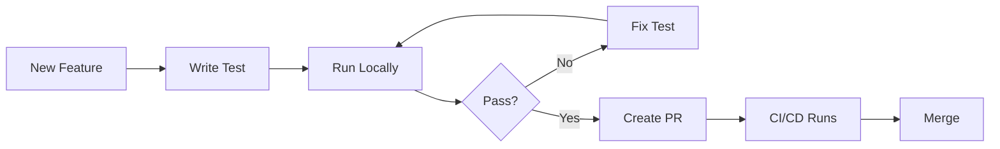
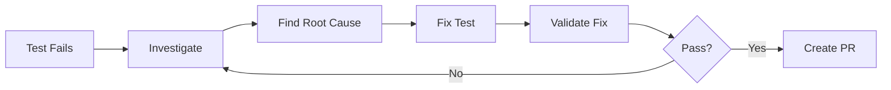
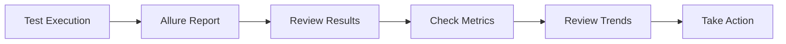

# Onboarding Playbook

## Overview

This playbook provides a **2-hour adoption plan** for new teams joining the Quality Engineering platform. It covers essential setup, standards, and workflows to get teams productive quickly.

## 2-Hour Adoption Plan

### Hour 1: Foundation (60 minutes)

#### 15 Minutes: Platform Overview
- Review [Platform Overview](01-platform-overview.md)
- Understand platform components
- Review repository ecosystem

**Deliverable**: Understanding of platform architecture

#### 15 Minutes: Repository Setup
- Clone test automation repositories
- Set up local development environment
- Configure IDE and tools

**Deliverable**: Local environment ready

#### 15 Minutes: Standards Review
- Review [Test Strategy Standards](05-test-strategy-standards.md)
- Understand naming conventions
- Review tagging strategy

**Deliverable**: Knowledge of standards

#### 15 Minutes: Quality Gates
- Review [Quality Gates](03-quality-gates.md)
- Understand gate requirements
- Review gate configuration

**Deliverable**: Understanding of quality gates

### Hour 2: Hands-On (60 minutes)

#### 20 Minutes: First Test
- Write a simple smoke test
- Follow naming conventions
- Apply proper tagging

**Deliverable**: First test written

#### 20 Minutes: Test Execution
- Run tests locally
- Generate Allure report
- Review test results

**Deliverable**: Test executed and report reviewed

#### 20 Minutes: CI/CD Integration
- Create a test branch
- Open a Pull Request
- Observe quality gate execution

**Deliverable**: PR created and gates executed

## Onboarding Checklist

### Pre-Onboarding

- [ ] Access to repositories granted
- [ ] Development environment requirements documented
- [ ] Team introduction scheduled
- [ ] Onboarding materials shared

### Day 1: Setup

- [ ] Local environment configured
- [ ] Repositories cloned
- [ ] IDE and tools installed
- [ ] Access to CI/CD system
- [ ] Access to reporting tools

### Day 2: Learning

- [ ] Platform overview reviewed
- [ ] Standards documentation read
- [ ] Quality gates understood
- [ ] Release workflows reviewed
- [ ] First test written

### Week 1: Practice

- [ ] Multiple tests written
- [ ] Tests executed in CI/CD
- [ ] Allure reports reviewed
- [ ] Quality gates experienced
- [ ] Questions answered

### Week 2: Integration

- [ ] Contributing to test suite
- [ ] Following PR process
- [ ] Understanding observability
- [ ] Participating in reviews

## Environment Setup

### Prerequisites

1. **Java Development Kit (JDK)**:
   - Version: JDK 11 or higher
   - Installation: Follow platform-specific instructions

2. **Maven**:
   - Version: 3.6 or higher
   - Installation: Download from Apache Maven

3. **Git**:
   - Version: 2.20 or higher
   - Installation: Platform-specific

4. **IDE**:
   - IntelliJ IDEA (recommended) or Eclipse
   - Install plugins: Cucumber, Allure

### Local Setup Steps

```bash
# 1. Clone repositories
git clone <ui-test-repo-url>
git clone <api-test-repo-url>
git clone <performance-test-repo-url>

# 2. Navigate to repository
cd ui-test-automation

# 3. Install dependencies
mvn clean install

# 4. Run tests
mvn test

# 5. Generate Allure report
mvn allure:report
mvn allure:serve
```

### Configuration

1. **Test Configuration**:
   - Update `application.properties` or `config.yml`
   - Set test environment URLs
   - Configure test data paths

2. **CI/CD Configuration**:
   - Review `.github/workflows/` or CI config
   - Understand quality gate triggers
   - Configure notifications

## Quick Start Guide

### Writing Your First Test

#### UI Test Example

```java
@Test
@Tag("smoke")
@Tag("critical")
@Tag("login")
public void testUserCanLoginWithValidCredentials() {
    // Arrange
    LoginPage loginPage = new LoginPage(driver);
    
    // Act
    loginPage.navigateToLogin();
    loginPage.enterUsername("valid-user");
    loginPage.enterPassword("valid-password");
    loginPage.clickLogin();
    
    // Assert
    assertTrue(loginPage.isUserLoggedIn(), "User should be logged in");
}
```

#### API Test Example

```java
@Test
@Tag("smoke")
@Tag("api")
public void testGetUser() {
    // Arrange
    String userId = "123";
    
    // Act
    Response response = given()
        .baseUri("https://api.example.com")
        .pathParam("id", userId)
    .when()
        .get("/api/users/{id}")
    .then()
        .statusCode(200)
        .extract()
        .response();
    
    // Assert
    assertEquals("John Doe", response.jsonPath().getString("name"));
}
```

### Running Tests

```bash
# Run all tests
mvn test

# Run smoke tests only
mvn test -Dgroups=smoke

# Run specific test
mvn test -Dtest=LoginTest

# Run with Allure
mvn clean test allure:report
```

## Common Workflows

### Workflow 1: Adding a New Test



**Steps**:
1. Create feature branch: `git checkout -b feature/add-login-test`
2. Write test following naming conventions
3. Tag test appropriately (`@smoke`, `@regression`, etc.)
4. Run test locally: `mvn test`
5. Create PR with description
6. Wait for quality gates to pass
7. Get approval and merge

### Workflow 2: Fixing a Failing Test



**Steps**:
1. Review Allure report for failure details
2. Check screenshots/logs
3. Reproduce failure locally
4. Identify root cause
5. Fix test or application issue
6. Validate fix locally
7. Create PR with fix

### Workflow 3: Reviewing Test Results



**Steps**:
1. Access Allure report (CI/CD or local)
2. Review test execution summary
3. Check pass/fail rates
4. Review failed tests
5. Check screenshots/logs for failures
6. Review trends over time
7. Take action if needed

## Resources

### Documentation

- [Platform Overview](01-platform-overview.md)
- [Test Strategy Standards](05-test-strategy-standards.md)
- [Quality Gates](03-quality-gates.md)
- [Release Workflows](04-release-workflows.md)

### Tools

- **Allure**: Test reporting
- **Maven**: Build tool
- **Git**: Version control
- **IDE**: IntelliJ IDEA or Eclipse

### Support

- **Team Slack Channel**: For questions and support
- **Office Hours**: Weekly Q&A sessions
- **Documentation**: This repository
- **Issue Tracker**: GitHub Issues

## Troubleshooting

### Common Issues

1. **Tests Fail Locally but Pass in CI**:
   - Check environment differences
   - Verify test data
   - Check configuration

2. **Allure Report Not Generating**:
   - Verify Allure plugin configuration
   - Check Maven version
   - Review build logs

3. **Quality Gates Failing**:
   - Review gate requirements
   - Check test results
   - Review Allure reports

### Getting Help

- Check documentation first
- Search existing issues
- Ask in team Slack channel
- Schedule office hours

## Success Criteria

After completing onboarding, you should be able to:

- [ ] Write tests following standards
- [ ] Run tests locally and in CI/CD
- [ ] Generate and review Allure reports
- [ ] Understand quality gates
- [ ] Create PRs and follow workflow
- [ ] Navigate documentation
- [ ] Get help when needed

## Next Steps

After onboarding:

1. **Week 1**: Write 5-10 tests, get familiar with workflows
2. **Week 2**: Contribute to test suite, participate in reviews
3. **Month 1**: Become productive team member
4. **Ongoing**: Continue learning, contribute improvements

## Feedback

We continuously improve onboarding based on feedback. Please share:
- What worked well
- What was confusing
- What's missing
- Suggestions for improvement

Submit feedback via GitHub Issues or team Slack channel.

## Next Steps

- Review [Test Strategy Standards](05-test-strategy-standards.md) for detailed guidelines
- See [Quality Gates](03-quality-gates.md) for gate requirements
- Check [Reporting and Evidence](07-reporting-and-evidence.md) for report standards

