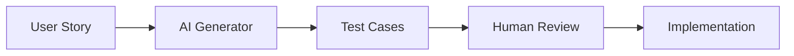
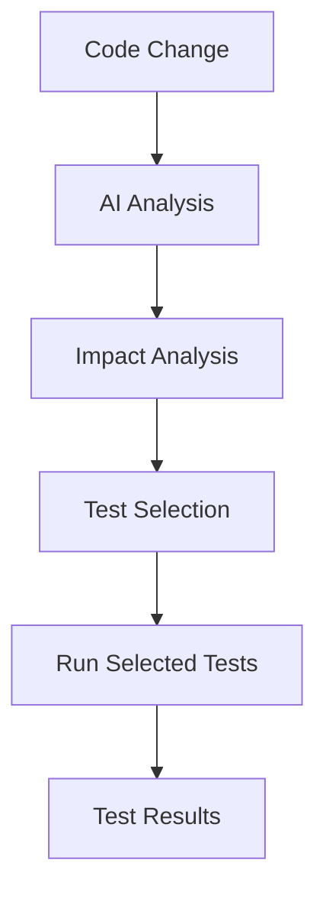

# AI-Assisted Quality Engineering

## Overview

This document outlines practical AI use cases for Quality Engineering. Focus is on real, implementable applications that enhance testing efficiency and quality, avoiding hype or theoretical concepts.

## AI Use Cases

### 1. Test Generation Assistance

**Use Case**: Generate test cases from requirements or user stories

**Implementation**:
- Input: User story or requirement description
- AI: Generates test scenarios and test steps
- Output: Test cases ready for review and implementation

**Benefits**:
- Faster test case creation
- More comprehensive coverage
- Consistency in test design

**Limitations**:
- Requires human review
- May need refinement
- Context-specific knowledge needed

**Example Workflow**:

### 2. Flaky Test Root Cause Analysis

**Use Case**: Analyze flaky test failures to identify root causes

**Implementation**:
- Input: Test execution logs, screenshots, error messages
- AI: Analyzes patterns, identifies common causes
- Output: Root cause suggestions and fix recommendations

**Benefits**:
- Faster flaky test resolution
- Pattern recognition across tests
- Data-driven insights

**Example**:
- Analyzes 100 flaky test failures
- Identifies: 60% are timing issues, 30% are test isolation
- Recommends: Add explicit waits, improve test cleanup

### 3. Test Maintenance Automation

**Use Case**: Automatically update tests when application changes

**Implementation**:
- Input: Application changes (code diff, UI changes)
- AI: Identifies affected tests, suggests updates
- Output: Updated test code or recommendations

**Benefits**:
- Reduced maintenance burden
- Faster adaptation to changes
- Consistency in updates

**Limitations**:
- Requires careful review
- May not catch all impacts
- Complex changes may need manual intervention

### 4. Intelligent Test Selection

**Use Case**: Select relevant tests to run based on code changes

**Implementation**:
- Input: Code changes (files, functions modified)
- AI: Analyzes impact, selects relevant tests
- Output: Optimized test suite to run

**Benefits**:
- Faster feedback cycles
- Reduced CI/CD execution time
- Focused test execution

**Example**:

### 5. Test Data Generation

**Use Case**: Generate realistic test data for test execution

**Implementation**:
- Input: Data schema or requirements
- AI: Generates realistic, varied test data
- Output: Test data files or database records

**Benefits**:
- Faster test data creation
- More realistic test scenarios
- Better edge case coverage

**Example**:
- Generate user profiles with realistic names, emails, addresses
- Generate payment data with valid card numbers (test mode)
- Generate product catalogs with varied attributes

### 6. Defect Prediction

**Use Case**: Predict areas likely to have defects based on code and test metrics

**Implementation**:
- Input: Code complexity, test coverage, historical defects
- AI: Analyzes patterns, predicts risk areas
- Output: Risk assessment and recommendations

**Benefits**:
- Proactive quality focus
- Better resource allocation
- Early defect detection

**Limitations**:
- Predictions are probabilistic
- Requires historical data
- May have false positives

### 7. Natural Language Test Queries

**Use Case**: Query test results and metrics using natural language

**Implementation**:
- Input: Natural language question
- AI: Understands intent, queries test data
- Output: Answer or visualization

**Benefits**:
- Easier access to test information
- No need to learn query languages
- Faster insights

**Example Questions**:
- "What tests failed in the last release?"
- "Show me flaky tests from the past month"
- "Which features have the lowest test coverage?"

## Implementation Roadmap

### Phase 1: Foundation (Months 1-3)

**Focus**: Data collection and basic AI integration

- Collect test execution data
- Set up data pipelines
- Implement basic test generation
- Pilot with one team

**Deliverables**:
- Test data collection system
- Basic AI test generator
- Pilot results and learnings

### Phase 2: Enhancement (Months 4-6)

**Focus**: Advanced use cases and integration

- Implement flaky test analysis
- Add intelligent test selection
- Enhance test generation
- Expand to all teams

**Deliverables**:
- Flaky test analysis tool
- Intelligent test selection
- Enhanced test generation
- Team adoption

### Phase 3: Optimization (Months 7-12)

**Focus**: Advanced analytics and automation

- Defect prediction
- Natural language queries
- Test maintenance automation
- Continuous improvement

**Deliverables**:
- Defect prediction model
- Natural language interface
- Automated test maintenance
- ROI measurement

## AI Tool Selection

### Considerations

1. **Integration**: Must integrate with existing tools
2. **Cost**: License and infrastructure costs
3. **Customization**: Ability to customize for specific needs
4. **Support**: Vendor support and documentation
5. **Security**: Data privacy and security requirements

### Tool Categories

1. **Test Generation Tools**:
   - AI-powered test case generators
   - Code-to-test generators
   - Requirements-to-test tools

2. **Test Analysis Tools**:
   - Flaky test analyzers
   - Test impact analyzers
   - Coverage analyzers

3. **Test Data Tools**:
   - Synthetic data generators
   - Test data management platforms

4. **Analytics Platforms**:
   - Quality analytics platforms
   - Predictive analytics tools

## Best Practices

### Data Quality

- Ensure high-quality training data
- Regularly update models
- Validate AI outputs
- Monitor model performance

### Human Oversight

- Always review AI-generated content
- Validate AI recommendations
- Maintain human expertise
- Use AI as augmentation, not replacement

### Incremental Adoption

- Start with low-risk use cases
- Pilot with small teams
- Gather feedback and iterate
- Scale gradually

### Measurement

- Track AI effectiveness
- Measure time savings
- Assess quality improvements
- Calculate ROI

## Risks and Mitigation

### Risks

1. **Over-reliance on AI**:
   - Risk: Reduced human expertise
   - Mitigation: Maintain human review and oversight

2. **Incorrect AI Outputs**:
   - Risk: Wrong test cases or recommendations
   - Mitigation: Always validate AI outputs

3. **Data Privacy**:
   - Risk: Sensitive data in AI systems
   - Mitigation: Use on-premise or secure cloud solutions

4. **Cost Overruns**:
   - Risk: High AI tool costs
   - Mitigation: Start small, measure ROI, scale carefully

## Success Metrics

Track the following metrics:

1. **Efficiency**:
   - Time saved in test creation
   - Faster test execution (intelligent selection)
   - Reduced maintenance time

2. **Quality**:
   - Improved test coverage
   - Faster flaky test resolution
   - Better defect detection

3. **Adoption**:
   - Team usage rates
   - User satisfaction
   - Tool effectiveness

## Future Considerations

### Emerging Trends

1. **LLM Integration**: Large language models for test generation
2. **Computer Vision**: Visual test validation
3. **Predictive Analytics**: Advanced defect prediction
4. **Autonomous Testing**: Self-healing tests

### Continuous Learning

- Stay updated on AI advancements
- Evaluate new tools and techniques
- Pilot promising technologies
- Share learnings across teams

## Next Steps

- Review [Test Strategy Standards](05-test-strategy-standards.md) for test creation guidelines
- See [Flaky Tests Policy](06-flaky-tests-policy.md) for flaky test management
- Check [Observability](08-observability.md) for quality metrics

