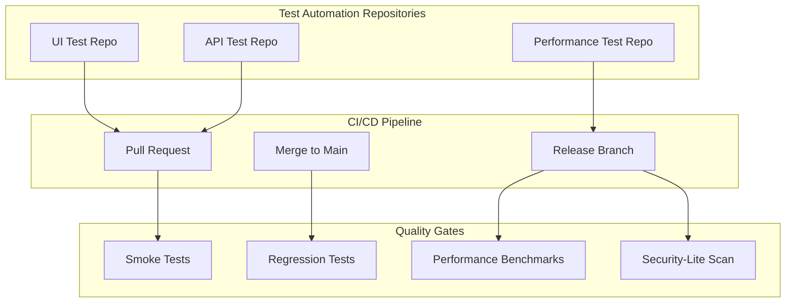
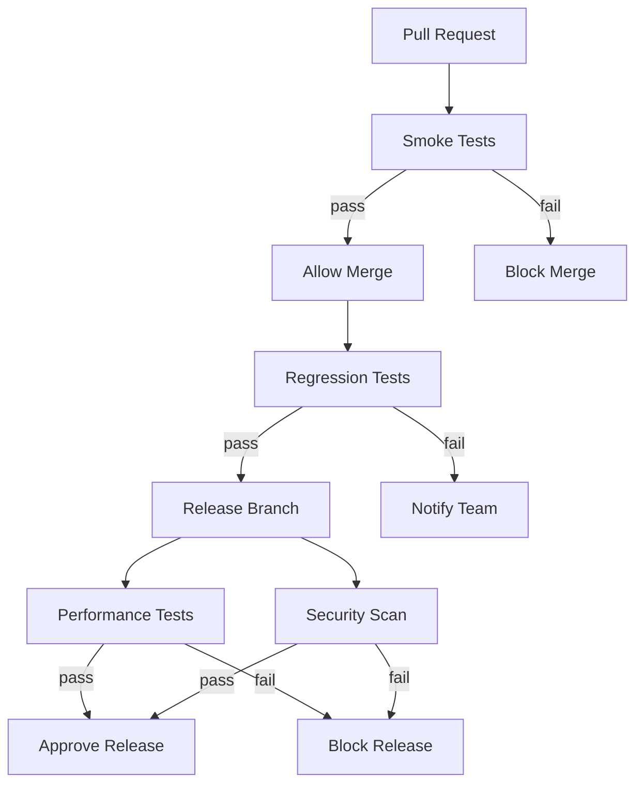
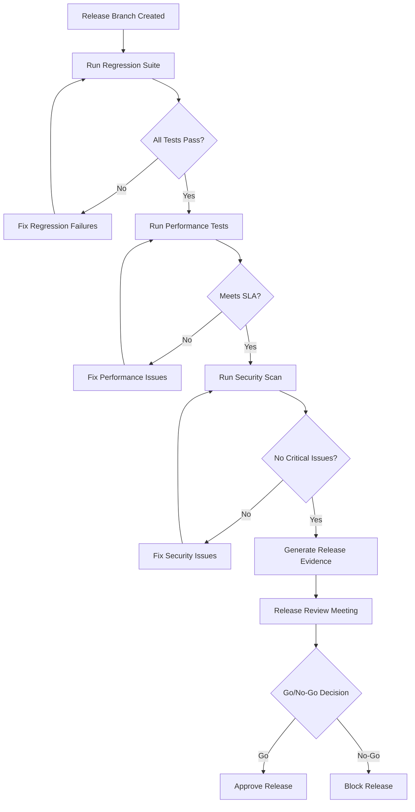
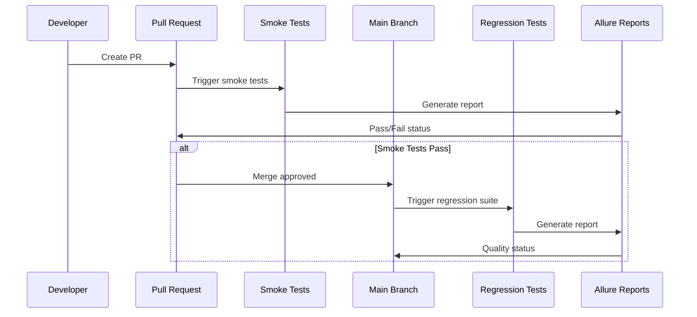
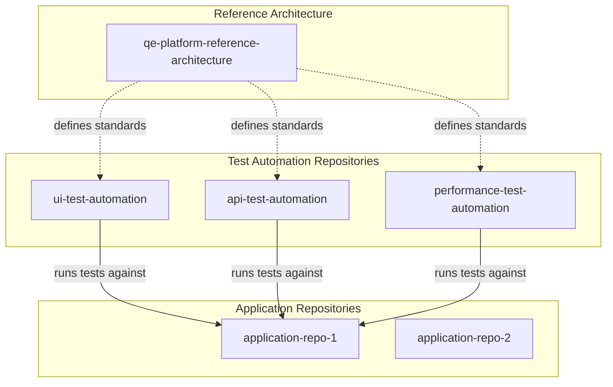
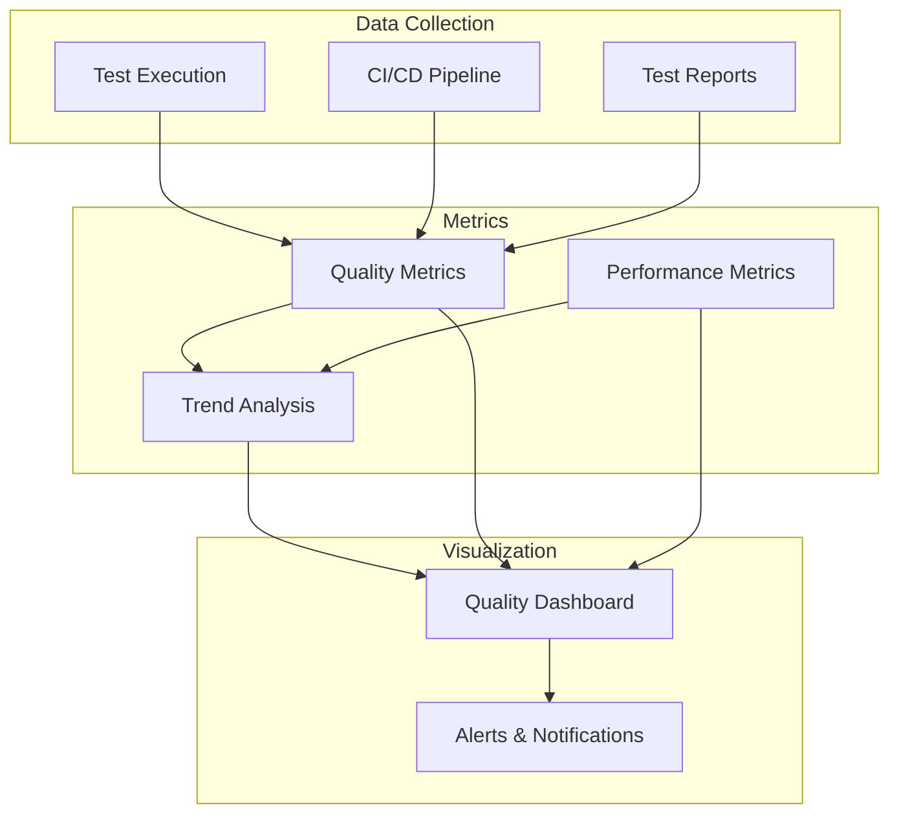
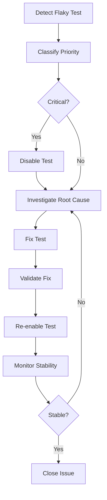
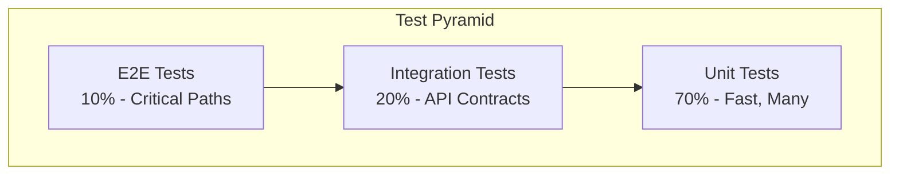
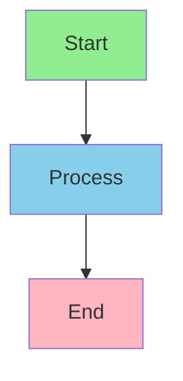

# Mermaid Diagram Snippets

This document contains reusable Mermaid diagram snippets for documentation. Copy and modify these snippets as needed.

## Platform Architecture

### Component Diagram

## Quality Gates

### Quality Gate Workflow

## Release Workflow

### Release Readiness Flow

## Test Execution

### Test Execution Flow

## Repository Ecosystem

### Repository Relationships

## Observability

### Observability Components

## Flaky Test Management

### Flaky Test Workflow

## Test Pyramid

### Test Distribution

## Usage Instructions

1. **Copy the snippet** you need
2. **Paste into your markdown file** within a mermaid code block
3. **Modify as needed** for your specific use case
4. **Test rendering** to ensure diagram displays correctly

## Customization Tips

- **Colors**: Add style definitions for visual emphasis
- **Labels**: Modify labels to match your terminology
- **Layout**: Change graph direction (TB, LR, etc.)
- **Grouping**: Use subgraphs to organize components
- **Styling**: Add CSS classes for custom styling

## Example with Styling

